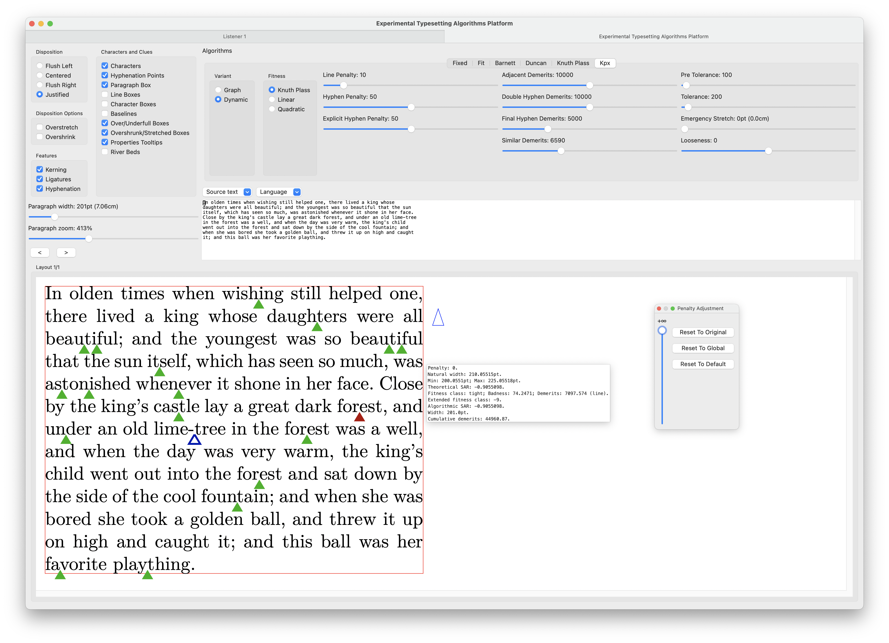

# For everyone
ETAP is a platofrm designed to ease experimentation with and demonstration of
typesetting algorithms. It currently focuses on paragraph formatting. ETAP is
written in Common Lisp.

Before trying it out, please make sure that you have the [Latin
Modern](https://www.gust.org.pl/projects/e-foundry/latin-modern) (10pt) font
installed on you machine. The OTF version will do just fine, and can be
downloaded from
[here](https://www.gust.org.pl/projects/e-foundry/latin-modern/download).

# For Lispers
## Dependencies
- [TFM](https://github.com/didierverna/tfm) (my TeX Font Metrics library),
  also available in Quicklisp.
## Portability
The core is portable but there's only a Lispworks/CAPI GUI for now. I'll
gladly accept new GUIs, such as */McClim, ECL/EQL, /etc./
## Quickstart
```lisp
(asdf:load-system :etap)
(etap:run)
```

# For non-Lispers
The following instructions should help you set up a Common Lisp environment
and run ETAP on your machine.

1. Download [LispWorks](http://www.lispworks.com) for your system. LispWorks
   is a proprietary implementation of the Common Lisp language, but there's a
   "Personal Edition" which is free with some limitations (with little impact
   on this project). LispWorks is currently needed for the GUI.
2. Download [quicklisp.lisp](https://beta.quicklisp.org/quicklisp.lisp) to
   your home directory. Quicklisp is a Common Lisp library manager. This file
   contains some installation code that is only needed once, to bootstrap the
   system.
3. Open LispWorks, and at the prompt, type
   ```lisp
   (load "~/quicklisp.lisp")
   ```
	Ah, and welcome to your very first Common Lisp function call, by the way
   :-) The installer should now ask you to type the following line.
   ```lisp
   (quicklisp-quickstart:install)
   ```
4. Once this is done, you can delete the previously downloaded
   `quicklisp.lisp` file.
5. Quicklisp has now installed a `quicklisp/` subdirectory directly under your
   home directory, and there should also be a `quicklisp/local-projects/`
   subdirectory in there. If not, please create it.
6. Clone ETAP's [GitHub](https://github.com/didierverna/etap) repository in
   there.

Your Lisp environment is now all set! From now on, everytime you want
to play with ETAP, open LispWorks and type this:
```lisp
(load "~/quicklisp/setup.lisp")
(ql:quickload :etap)
(etap:run)
```
